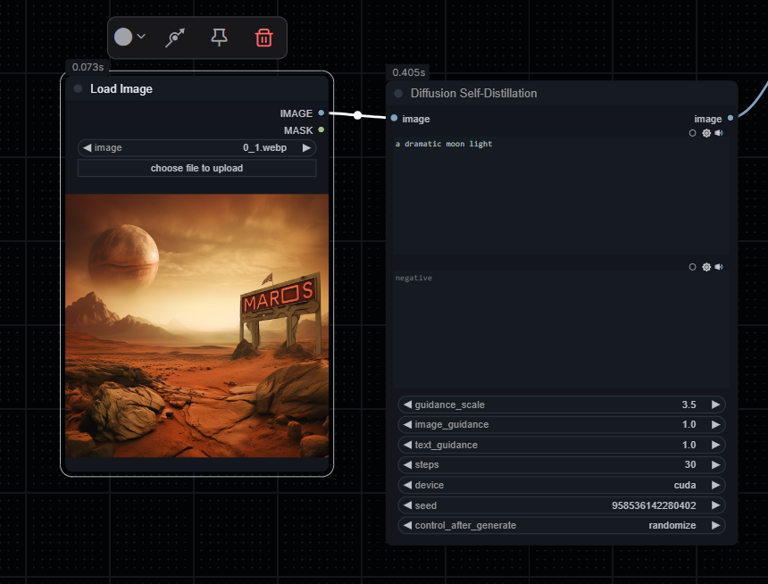

**** IMPORTANT NOTE: This is not a working node yet, it is still under development. ****

# Diffusion Self-Distillation for ComfyUI


This ComfyUI extension adds the Diffusion Self-Distillation (DSD) process as a node for enhancing image quality through AI-powered upscaling and refinement.


## What is Diffusion Self-Distillation?

Diffusion Self-Distillation (DSD) is a technique that uses a smaller, distilled diffusion model to enhance images while maintaining the style and details of the original. This implementation offers:

- Enhanced image quality and details
- Preservation of the original style
- Text-guided refinement
- Fast processing with GPU acceleration

## Installation

### Prerequisites

- [ComfyUI](https://github.com/comfyanonymous/ComfyUI) installed and working
- Python 3.8+ with PyTorch installed
- CUDA-capable GPU recommended (though CPU mode is supported)

### Installation Steps

1. **Clone this repository** into the `custom_nodes` directory of your ComfyUI installation:
   ```bash
   cd ComfyUI/custom_nodes
   git clone https://github.com/MaisonMeta/DSD_comfy_node.git
   ```

2. **Install required dependencies**:
   ```bash
   pip install safetensors numpy torch pillow tqdm
   ```

3. **Download the model files**:
   - **Transformer Model**: Download from [Hugging Face](https://huggingface.co/primecai/dsd_model)
   - **LoRA Weights**: Download from [Google Drive](https://drive.google.com/drive/folders/1VStt7J2whm5RRloa4NK1hGTHuS9WiTfO) (file: `pytorch_lora_weights.safetensors`)

4. **Place the model files** in one of these locations:
   - **Option 1**: ComfyUI's models directory
     - `ComfyUI/models/dsd-models/transformer/` (create directory and place model files inside)
     - `ComfyUI/models/dsd-models/pytorch_lora_weights.safetensors`
   
   - **Option 2**: Custom location (requires configuration in ComfyUI)
     - Place files anywhere and update ComfyUI's `extra_model_paths.yaml` to include your path

## Model File Structure

For proper loading, ensure your model files are organized as follows:
```
ComfyUI/models/dsd-models/
├── transformer/
│   ├── diffusion_pytorch_model.safetensors
│   ├── ...other model files...
└── pytorch_lora_weights.safetensors
```

## Usage

### Basic Usage

1. Find the "Diffusion Self-Distillation (Image Enhancer)" node in the ComfyUI node browser. 
   - **Note**: The node is registered with the name "DiffusionSelfDistillation" and should be searchable.
   - Look for it in the "Image" category if you can't find it by name.

2. Connect an image output to the node's input.
3. Set your parameters (see below).
4. Run the workflow to generate an enhanced image.

### Finding the Node

If you have trouble finding the node:
1. Search for "Diffusion" in the node search box
2. Look in the "image" category of nodes
3. The full name is "Diffusion Self-Distillation (Image Enhancer)"
4. If you still can't find it, restart ComfyUI completely

Here's what the node looks like in the ComfyUI interface:



*Note: If the image above doesn't appear, you may need to create a screenshot of the node in ComfyUI and save it as "node-preview.png" in the repository root folder.*

### Parameters

- **image**: Input image to enhance
- **positive**: Positive prompt text describing what you want to enhance/emphasize
- **negative**: Negative prompt text for what to avoid (optional)
- **guidance_scale**: Controls how much the model follows the prompt (default: 3.5)
- **image_guidance**: Controls how much the output resembles the input image (default: 1.0)
- **text_guidance**: Controls the importance of text conditioning (default: 1.0)
- **steps**: Number of diffusion steps (more steps = better quality, slower processing)
- **device**: Processing device - CUDA (GPU) or CPU

### Tips for Best Results

- **Use descriptive prompts**: For example, "a detailed portrait with sharp focus and clear eyes"
- **Start with lower steps**: Try 10-15 steps first, then increase if needed
- **Balance image_guidance**: Lower values (0.5-1.0) allow more creative changes, higher values (1.5-3.0) preserve more of the original
- **Ideal image sizes**: Input images around 512px or 1024px work best

## Example Workflow

Here's a simple workflow to get started:

1. Add a **Load Image** node and load your image
2. Connect it to the **DSD** node
3. Set a descriptive prompt like "detailed photo, high resolution, sharp focus"
4. Set guidance_scale=3.0, image_guidance=1.0, steps=20
5. Add a **Save Image** node to the output
6. Run the workflow

For more complex workflows, you can combine DSD with other nodes:
- Use **UpscaleImage** node before DSD for larger results
- Add **ImageBlend** after DSD to mix with the original
- Chain multiple DSD nodes with different prompts for layered effects

## Troubleshooting

### Common Issues

- **"No module named 'folder_paths'"**: This is normal during standalone testing; ComfyUI provides this module at runtime.
- **CUDA out of memory**: Try reducing the image size or using fewer steps.
- **Pixelated outputs**: Try increasing the steps or adjusting the image_guidance value.
- **Model not found**: Verify model file locations match the expected paths.
- **Black/corrupted images**: Check that your input is a valid RGB image.

### Advanced Debugging

- Check the console for detailed error messages
- Set `print(tensor.shape)` statements to debug tensor dimensions
- For unusual input shapes, the node will attempt to visualize them rather than process them


## Credits and Acknowledgments

- **Original Research Paper**: ["Diffusion Self-Distillation for Zero-Shot Customized Image Generation"](https://github.com/primecai/diffusion-self-distillation) (CVPR 2025) by Shengqu Cai, Eric Ryan Chan, Yunzhi Zhang, Leonidas Guibas, Jiajun Wu, and Gordon Wetzstein
- **Original Implementation**: [primecai/diffusion-self-distillation](https://github.com/primecai/diffusion-self-distillation) GitHub repository
- **Pretrained Models**: Models provided by the original authors via [HuggingFace](https://huggingface.co/primecai/dsd_model)
- **ComfyUI Integration**: Custom implementation for ComfyUI compatibility
- **Additional Optimizations**: Enhanced tensor handling for improved performance

If you use this implementation in your work, please cite the original paper:

```bibtex
@inproceedings{cai2024dsd,
    author={Cai, Shengqu and Chan, Eric Ryan and Zhang, Yunzhi and Guibas, Leonidas and Wu, Jiajun and Wetzstein, Gordon.},
    title={Diffusion Self-Distillation for Zero-Shot Customized Image Generation},
    booktitle={CVPR},
    year={2025}
}
```

## License

This project is distributed under the MIT License. See the `LICENSE` file for more information.

## Contributing

Contributions are welcome! Please feel free to submit a Pull Request.

----

For questions, bug reports, or feature requests, please open an issue on GitHub.